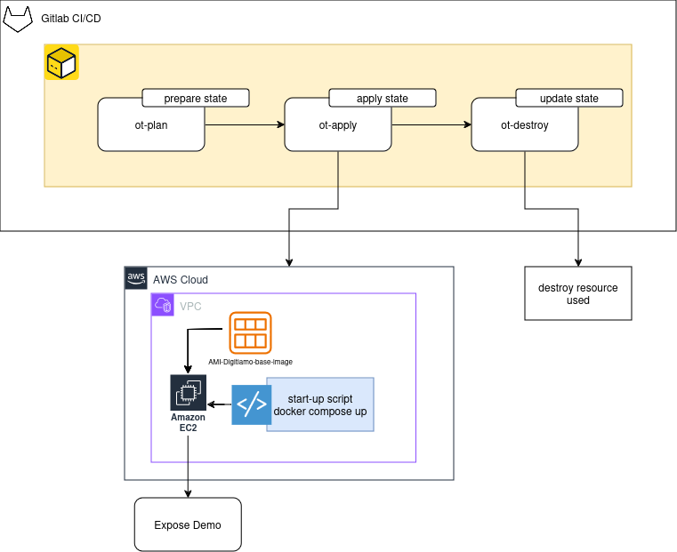

# POC-DEMO-DEPLOY

The target of this repo is show you a poc of an idea about to deploy a demo.

## The idea

The idea is that a developer creates a docker-compose-demo.yml with the information to rise up an enviroment self contained in local.
This docker compose dedicated for demo will be raise in remote environment like in local.\
This will be possible with a gitlab CI/CD that once triggered creates in AWS workspace an EC2 from an AMI (digitiamo base image) and expose the demo with public ip.

After the demo the user asks to pipeline to destroy the resources instantiates.

